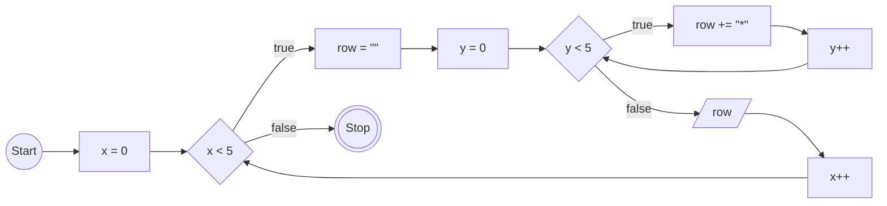
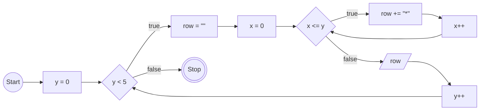

# JavaScript 3

## Program 1

### Pola
```
*****
*****
*****
*****
*****
```

### Flowchart

```mermaid
flowchart LR
    A((Start))
    B[x = 0]
    C{x < 5}
    D[row = #quot;#quot;]
    E[y = 0]
    F{y < 5}
    G[row += #quot;*#quot;]
    H[y++]
    I[/row/]
    J[x++]
    Z(((Stop)))

    A --> B
    B --> C
    C --true--> D
    D --> E
    E --> F
    F --true--> G
    G --> H
    H --> F
    F --false--> I
    I --> J
    J --> C
    C --false--> Z
```

## Program 2

### Pola
```
*
**
***
****
*****
```

### Flowchart

```mermaid
flowchart LR
    A((Start))
    B[y = 0]
    C{y < 5}
    D[row = #quot;#quot;]
    E[x = 0]
    F{x <= y}
    G[row += #quot;*#quot;]
    H[x++]
    I[/row/]
    J[y++]
    Z(((Stop)))

    A --> B
    B --> C
    C --true--> D
    D --> E
    E --> F
    F --true--> G
    G --> H
    H --> F
    F --false--> I
    I --> J
    J --> C
    C --false--> Z
```